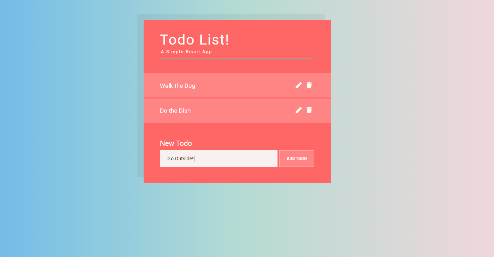

# To do app

This app is used to keep track of your tasks! You can add, edit and remove your tasks here.

## Table of contents

- [Overview](#overview)
  - [The challenge](#the-challenge)
  - [Screenshot](#screenshot)
- [My process](#my-process)
  - [Built with](#built-with)
  - [What I learned](#what-i-learned)
- [Author](#author)

## Overview

### The challenge

Users should be able to:

- Add new tasks! Updated the tasks! Remove the tasks!
- Click on the tasks and they will be crossed

### Screenshot



## My process

### Built with

- Semantic HTML5 markup
- CSS custom properties
- Flexbox
- Javascript
- REACTJS

### What I learned

```css
.Todo.completed .Todo-task:before {
  content: "";
  position: absolute;
  top: 50%;
  left: -0.5rem;
  display: block;
  width: 0%;
  height: 4px;
  background: #fff;
  animation: strikeitem 0.3s ease-in 0s forwards;
}
```

```js
 update(id, updatedTask) {
    const updatedTodos = this.state.todos.map((todo) => {
      if (todo.id === id) {
        return { ...todo, task: updatedTask };
      }
      return todo;
    });
    this.setState({ todos: updatedTodos });
  }
```

## Author

- Frontend Mentor - [@manhtran1611](https://www.frontendmentor.io/profile/manhtran1611)
- Facebook - [@manhtranduc1611](https://www.facebook.com/manhtranduc1611)
